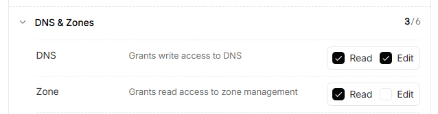
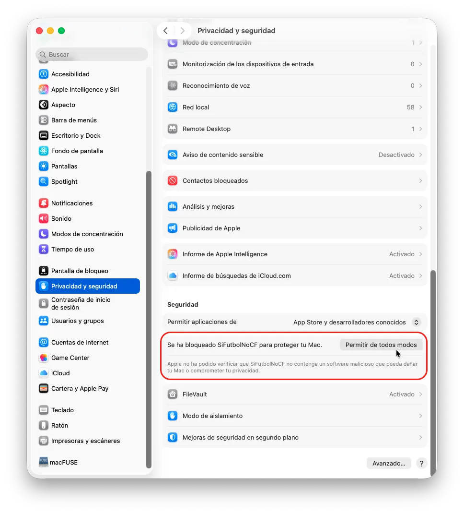

Este proyecto es una herramienta para mitigar de forma inteligente **los bloqueos dinámicos** impuestos por proveedores de servicios de Internet (ISP) y **La Liga** a Cloudflare en España cada vez que hay fútbol emitido en cerrado.

> [!NOTE]
> Este proyecto está inspirado en el trabajo de [JoseManuelPedraja/cffootballbypass-docker](https://github.com/JoseManuelPedraja/cffootballbypass-docker), pero ha sido reescrito en .NET 10 y modernizado para ofrecer mayor flexibilidad, soporte multiplataforma y múltiples formas de ejecución.

## Para qué sirve SiFutbolNoCF

En España, los ISP aplican bloqueos dinámicos en tiempo real a dominios que transmiten contenido deportivo no autorizado. A menudo, estos bloqueos se basan en identificar la dirección IP del servidor final de Cloudflare (cuando el proxy o "nube naranja" está activo) y bloquearla a nivel de red para todos los usuarios de dicho ISP. Esto provoca que, **cuando hay fútbol** emitido por canales de pago en España, **decenas de miles de sitios web legítimos que utilizan Cloudflare** como CDN (_Content Delivery Network_) se vean afectados por estos bloqueos y sus clientes y usuarios no puedan acceder a estos sitios 🤦🏻‍♂️

Puedes **leer los detalles [aquí](https://hayahora.futbol/#sobre-los-bloqueos)**.

Este programa consulta constantemente el _endpoint_ oficial de estado facilitado por https://hayahora.futbol/ (`https://hayahora.futbol/estado/data.json`) para conocer qué direcciones IP están siendo bloqueadas por los operadores en España. A continuación, resuelve por DNS las IPs asignadas a cada dominio configurado (registros A, AAAA o CNAME). En caso de detectarse que alguna de las IPs de Cloudflare del dominio está bloqueada, la aplicación interactúa de manera inmediata con la API de Cloudflare para **desactivar el _proxy_ (queda la "nube gris")**, exponiendo directamente la dirección IP original del servidor y evitando el bloqueo. Una vez finalizado el bloqueo (se termina el fútbol 🙄 y la IP queda libre en el listado), la aplicación **reactiva el proxy (vuelve la "nube naranja")** para restaurar la protección de origen, CDN y HTTPS. Además, almacena localmente en disco una caché de las IPs de Cloudflare para mantener la persistencia ante reinicios inesperados o cortes de suministro eléctrico.

>**IMPORTANTE**: si tu servidor web no tiene un certificado HTTPS propio asociado al dominio y solamente utiliza el de CloudFlare, me temo que esto no te servirá de nada porque hoy en día la mayoría de los navegadores modernos bloquean el acceso a sitios sin HTTPS o con certificados no válidos. En este caso, lo único que podrías hacer para que te sirva es configurar un certificado SSL gratuito de Let's Encrypt o similar en tu servidor para que, aunque el proxy esté desactivado, los usuarios puedan acceder sin problemas.

> [!WARNING]
> **Sobre la propagación y la caché DNS local**: los cambios en Cloudflare se aplican de forma inmediata en sus servidores autoritativos. Sin embargo, cualquier dispositivo que haya consultado tu dominio recientemente (por ejemplo, tu propio navegador, tu sistema operativo o el router de tu ISP) guardará la dirección IP anterior en su **caché DNS local** durante el tiempo de vida del registro (TTL, que suele ser de 300 segundos / 5 minutos).
> 
> Por este motivo, si estabas navegando por tu web justo antes del cambio, **tu ordenador puede tardar unos minutos en ver la nueva IP**. En cambio, **los visitantes nuevos o quienes no hayan entrado recientemente resolverán la IP actualizada de inmediato**. Para forzar la actualización instantánea en tu equipo de pruebas local, limpia la caché DNS de tu sistema operativo (`ipconfig /flushdns` en Windows, `sudo dscacheutil -flushcache; sudo killall -HUP mDNSResponder` en macOS, o `resolvectl flush-caches` en Linux) o prueba desde una red distinta (por ejemplo, desde el móvil con datos móviles).

## Características

- 🚀 **Compilado en .NET 10**: altamente optimizado, moderno y eficiente, y sin dependencias.
- 🐧💻🍏 **Multiplataforma**: ejecutables independientes de un solo archivo (*single-file*) compilados nativamente para Windows, macOS y Linux (x64 y ARM64).
- 🔄 **Doble modo de ejecución**:
  - **Modo Demonio**: ejecución periódica continua en bucle leyendo la configuración de archivos de configuración (`appsettings.json`, `appsettings.local.json` o variables de entorno). Permite también ejecutar una única iteración del bucle (`-1` / `--once`).
  - **Modo Ejecución Única (One-off)**: control total desde línea de comandos al proporcionar 6 argumentos para ejecuciones manuales rápidas.
- 🔑 **Precedencia inteligente de configuración**: resuelve parámetros desde archivos locales (`appsettings.local.json`, para desarrollo y que no vaya nada fuera del repo si haces un _fork_), `appsettings.json` y variables de entorno de forma segura para evitar subir credenciales a repositorios públicos.
- 🔍 **Auto-detección de Zonas de Cloudflare**: si no especificas el `CfZoneId`, el sistema lo buscará de manera autónoma utilizando la API de zonas de Cloudflare (para lo cual necesitarás un token de cuenta en vez de un token de perfil).
- 🗄️ **Caché de IPs originales de CloudFlare** para los dominios para poder restaurar la configuración de proxy en caso de reinicios inesperados o cortes de suministro eléctrico.
- 🎨 **Interfaz de Consola Clara y Jerárquica**: salida estructurada y legible con sangrado en 2 niveles y emojis descriptivos para que se adapte al color nativo de cualquier terminal (macOS, PowerShell, Linux, personalizados...) sin problemas de contraste.

## Cómo ponerlo en marcha

### 1. Configurar token de API de tipo Perfil (Específico de Zona)
Si prefieres restringir los permisos de tu API Token en Cloudflare por seguridad, puedes crear un token limitado a una sola zona específica.
- Ve a tu consola de `Cloudflare > My Profile > API Tokens` ([enlace directo](https://dash.cloudflare.com/profile/api-tokens)).
- Crea un token personalizado con el permiso `Zone - DNS - Edit`.
- En `Zone Resources`, selecciona `Specific zone` y elige el dominio o dominios deseados.

> **Importante**: dado que este tipo de token no tiene privilegios de cuenta globales, no puede consultar la API de zonas para auto-descubrir IDs. **Implica obligatoriamente configurar el parámetro `CfZoneId`** para cada dominio en el archivo de configuración.

### 2. Configurar token de API de tipo Cuenta (Auto-descubrimiento de Zonas)
Si deseas que la herramienta detecte automáticamente los IDs de zona de tus dominios sin tener que buscarlos e introducirlos a mano:
- En Cloudflare, ve a `Manage Accounts > Account API Tokens` (no hay acceso directo porque es distinto para cada cuenta).
- Crea un nuevo token personalizado con cualquier nombre (por ejemplo `SiFutbolNoCF`) y los siguientes permisos en el apartado `DNS & Zones`:
  - `DNS - Read/Edit` (para actualizar los registros).
  - `Zone - Read` (para buscar las zonas de la cuenta).
  
  Este sería su aspecto:

  

- En el desplegable de la parte superior (debajo de `Edit policy`) selecciona `All domains`
- Con este token, puedes dejar el campo `CfZoneId` vacío en la configuración y el programa se encargará de resolverlo en su primera ejecución.

### Redirigir logs a un archivo en disco (Modo Daemon)
Si estás ejecutando la aplicación en modo demonio permanente (por ejemplo, en un servidor Linux o mediante Systemd) y deseas almacenar toda la salida por consola en un archivo de log físico en disco para auditorías, puedes redirigir los flujos estándar de salida a un archivo y dejar los errores directamente a la terminal para detectarlos con facilidad:

**En Linux / macOS:**

```bash
./SiFutbolNoCF >> /var/log/sifutbolnocf.log 2> /dev/tty &
```
> [!NOTE]
> El operador `>>` añade los logs al final del archivo, `2> /dev/tty` envía errores a la terminal, y el `&` final envía el proceso a segundo plano.

> [!IMPORTANT]
> Para poder ejecutarlo **en Mac** tendrás que otorgarle **permisos de ejecución** con `chmod +x SiFutbolNoCF`. Además, **la primera vez** que lo ejecutes, al ser un programa descaargado de internet, tendrás que **autorizar su ejecución** desde los ajustes de seguridad del sistema:
>
>

**En Windows (PowerShell):**

```powershell
./SiFutbolNoCF.exe | Tee-Object -FilePath "sifutbolnocf.log" -Append
```

**En Windows (cmd):**

```cmd
 SiFutbolNoCF.exe >> sifutbolnocf.log 2> CON
```

## Cómo configurarlo

La aplicación busca y fusiona la configuración de varias fuentes con el siguiente orden de precedencia: **`appsettings.local.json` > `appsettings.json` > Variables de Entorno**.

### Opciones de configuración globales:

| Opción | Tipo | Descripción | Valor por defecto |
|---|---|---|---|
| `CfApiToken` | String | Token de autenticación de Cloudflare (tipo portador / *Bearer*). | *(Requerido)* |
| `IntervalSeconds` | Entero | Tiempo en segundos de espera entre ciclos en el modo continuo daemon. | `300` |
| `Verbosity` | String | Nivel de detalle de los mensajes por consola en modo daemon: `ChangesOnly` (muestra ciclo inicial y luego solo cambios o errores) o `Full` (muestra todos los detalles en cada ciclo). | `ChangesOnly` |
| `StatusUrl` | String | Endpoint de consulta del estado de bloqueo de IPs. Si cambiase en el futuro se podría modificar aquí. No es necesario ponerlo por defecto. | `https://hayahora.futbol/estado/data.json` |
| `Domains` | Lista | Array de objetos de dominios a monitorear y conmutar. | `[]` |

### Estructura de cada dominio bajo `Domains`:

Los dominios se configuran siempre en `appsettings.json` o `appsettings.local.json` (no es posible configurar dominios desde variables de entorno porque son estructuras complejas) y se hace mediante un array de objetos JSON con la siguiente estructura (los nombres son _case insensitive_):

- `name`: dominio raíz en Cloudflare (ej. `midominio.com`).
- `record`: subdominio o registro DNS que se modificará (ej. `www`, `api`, o `@` para indicar el dominio raíz).
- `type`: tipo de registro en la tabla DNS de Cloudflare (ej. `A`, `CNAME`, `AAAA`).
- `CfZoneId` _(Opcional)_: el ID de zona asignado por Cloudflare (lo puedes ver en la portada de tu dominio, a la derecha, abajo del todo). Si se deja vacío, el programa intentará resolverlo automáticamente consumiendo la API de zonas de Cloudflare, si has configurado una API de cuenta (pero si lo añades a mano te ahorras una llamada innecesaria a la API).

#### Ejemplo de `appsettings.json`:
```json
{
  "CfApiToken": "TU_CLOUDFLARE_API_TOKEN",
  "IntervalSeconds": 300,
  "Verbosity": "ChangesOnly",
  "StatusUrl": "https://hayahora.futbol/estado/data.json",
  "Domains": [
    {
      "name": "midominio.com",
      "record": "@",
      "type": "A",
      "CfZoneId": "opcional_zone_id_aqui"
    },
    {
      "name": "midominio.com",
      "record": "www",
      "type": "CNAME"
    }
  ]
}
```

Se incluye un archivo `appsettings.json` de ejemplo del que partir.

>**IMPORTANTE**: si en CloudFlare tienes configurados tanto el dominio principal (midominio.com) como el subdominio (www.midominio.com), debes **añadir ambos** a la monitorización si quieres que se desbloqueen adecuadamente.

## Setup Alternativo (Evitar tener el PC encendido)

### A. Configuración en Azure WebJobs

Para ejecutar esta herramienta de forma continua en la nube sin costo adicional o dentro del plan gratuito de App Services:

1. Descarga (o compila) la aplicación para `win-x64`.
2. Ve al directorio de salida de publicación y comprime en un archivo `.zip` los archivos (incluyendo el ejecutable `SiFutbolNoCF.exe` y tu archivo `appsettings.json`).
3. Ve a tu recurso **App Service** en Azure Portal.
4. En el menú lateral, busca `WebJobs` y haz clic en `Add`.
5. Rellena los datos:
   - `Name`: `si-futbol-no-cf`
   - `File Upload`: sube tu archivo `.zip`.
   - `Type`: selecciona `Continuous` (para modo demonio continuo) o `Triggered` (programado mediante una expresión CRON si usas el modo único `-1`).
   - `Scale`: `Single Instance`.
6. Haz clic en `OK`. Azure ejecutará tu binario de forma ininterrumpida y mantendrá un log del proceso.

### B. Ejecución programada con GitHub Actions

Si prefieres no depender de ningún servidor propio o Azure App Service, puedes configurar un flujo de trabajo programado (_workflow schedule_) en GitHub:

1. Añade tus credenciales de Cloudflare a los _Secrets_ del repositorio de GitHub (ej. `CF_API_TOKEN` y `CF_ZONE_ID`).
2. Crea un archivo en tu repositorio bajo `.github/workflows/check-dns.yml` con una ejecución por ejemplo cada 5 minutos:

```yaml
name: SiFutbolNoCF
on:
  schedule:
    - cron: '*/5 * * * *' # Cada 5 minutos
  workflow_dispatch: # Permite ejecutar manualmente

jobs:
  run-switch:
    runs-on: ubuntu-latest
    steps:
      - name: Descargar repositorio
        uses: actions/checkout@v4
      - name: Configurar .NET
        uses: actions/setup-dotnet@v4
        with:
          dotnet-version: '10.0.x'
      - name: Ejecutar app (modo daemon pero una única vez)
        run: dotnet run --project SiFutbolNoCF.csproj -- -1
        env:
          CF_API_TOKEN: ${{ secrets.CF_API_TOKEN }}
          #OPCIONAL
          STATUS_URL: "https://hayahora.futbol/status.json"
```

## Ejemplo de log generado por la aplicación

El siguiente ejemplo muestra la salida estructurada de la consola cubriendo los diferentes estados posibles durante el ciclo de comprobación (detección de configuración, dominios sin cambios, activaciones/desactivaciones conmutadas con éxito, errores de Cloudflare y advertencias de conectividad):

```text
[2026-06-09 17:05:00] 🔍 CONFIG │ Auto-detectando ID de zona para midominio.com...
[2026-06-09 17:05:01] ✅ CONFIG │ ID de zona detectado para midominio.com: 9a5b7d6d5e4u3g2z1i0j

[2026-06-09 17:05:03] Consultando el estado de los dominios...

   ├─ 👀 midominio.com
   ├─── ✅ Estado: no bloqueado. Estado activateCfProxy deseado: ACTIVAR.
   ├─── 🔍 Buscando midominio.com (tipo: A)
   ├─── ℹ️ Sin cambios │ Ya está 🔒 ON (IP: 192.0.2.1)

   ├─ 👀 tiendaonline.es
   ├─── 🔴 Estado: BLOQUEADO. Estado activateCfProxy deseado: DESACTIVAR.
   ├─── 🔍 Buscando tiendaonline.es (tipo: A)
   ├─── ✅ Actualizado │ 🔒 ON → 🔓 OFF (IP: 198.51.100.24)

   ├─ 👀 blog.midominio.com
   ├─── ✅ Estado: no bloqueado. Estado activateCfProxy deseado: ACTIVAR.
   ├─── 🔍 Buscando blog.midominio.com (tipo: CNAME)
   ├─── ✅ Actualizado │ 🔓 OFF → 🔒 ON (IP: midominio.com)

   ├─ 👀 errortest.com
   ├─── 🔴 Estado: BLOQUEADO. Estado activateCfProxy deseado: DESACTIVAR.
   ├─── 🔍 Buscando errortest.com (tipo: A)
   ├─── ❌ Error al actualizar Cloudflare para errortest.com: Registro no encontrado. Verifica nombre correcto y tipo de registro

   ├─ 👀 servicio-caido.com
   ├─── ⚠️ Error al obtener el estado, se omitirá en este ciclo.

[2026-06-09 17:05:05] ✅ Ciclo completado
[2026-06-09 17:05:05] ⏳ Esperando 300 segundos antes de volver a comprobar...
```

## Preguntas frecuentes

### ¿Por qué lo necesito?
Si tu sitio web es legítimo y se ve afectado colateralmente por bloqueos de rangos de IPs de Cloudflare en determinados ISP durante eventos deportivos, este _script_ permite alternar de forma autónoma entre la protección de _proxy_ de Cloudflare y la conexión directa para saltarse las restricciones de ruta del ISP. Básicamente desactiva Cloudflare en tu dominio mientras dura el fútbol y lo vuelve a activar después, sin que tengas que hacer nada manualmente.

### ¿Es legal?
Sí. El programa únicamente interactúa con tu propia cuenta de Cloudflare a través de su API pública para modificar registros de DNS que te pertenecen legalmente. No ataca ni modifica sistemas ajenos. Solo te evita un problema.

### ¿Puedo monitorizar varios dominios?
Sí. La sección `Domains` de la configuración admite un número ilimitado de dominios y subdominios. Cada uno será evaluado de forma individual contra el servicio de estado y actualizado de forma independiente. Eso sí, dado que la clve de API es para una cuenta de CloudFlare determinada, todos los dominios deberían estar bajo esa misma cuenta (o al menos la API debería tener permisos para gestionarlos).

### ¿Qué pasa si se cae hayahora.futbol?
Si el _endpoint_ del estado de bloqueo no responde o devuelve un JSON no válido, el programa mostrará una advertencia en la consola omitiendo el dominio problemático y continuará procesando el resto de la lista. En el siguiente ciclo volverá a reintentar la conexión.

### ¿Cómo puedo probar si funciona?
1. Puedes forzar la conmutación manual utilizando el modo de ejecución única (*one-off*) pasando los 6 argumentos necesarios. Por ejemplo, desactivando el proxy:
   ```bash
   SiFutbolNoCF.exe miweb.com @ A false mi-api-token mi-zone-id
   ```
2. Revisa tu panel de DNS en Cloudflare para constatar si la nube del registro correspondiente ha cambiado a color gris.

## Cómo compilar desde el código fuente

Si prefieres compilar la aplicación por tu cuenta o realizar modificaciones en el código fuente:

### Requisitos previos
- [.NET 10.0 SDK](https://dotnet.microsoft.com/download/dotnet/10.0) instalado en tu sistema.

### 1. Compilación estándar y ejecución local
Para compilar y ejecutar directamente el proyecto en modo desarrollo:

```bash
# Compilar el proyecto
dotnet build

# Ejecutar una comprobación única
dotnet run -- --once

# Ejecutar en modo demonio continuo
dotnet run
```

### 2. Generar ejecutables autónomos (Single-File Self-Contained)
El proyecto está configurado para generar binarios independientes que no requieren tener instalado el runtime de .NET 10 en la máquina de destino:

- **En Windows**: ejecuta el script por lotes incluido en la raíz para compilar todas las plataformas de golpe:
  ```cmd
  build.bat
  ```

- **En Linux / macOS**: concede permisos de ejecución (solo la primera vez) y lanza el script bash:
  ```bash
  chmod +x build.sh
  ./build.sh
  ```
  Los binarios generados se guardarán organizados en la carpeta `./build/` para cada arquitectura (`win-x64`, `win-arm64`, `osx-x64`, `osx-arm64`, `linux-x64`, `linux-arm64`).

- **Mediante el CLI de .NET** para una plataforma específica:
  ```bash
  # Para Windows (x64)
  dotnet publish -c Release -r win-x64 --self-contained true -p:PublishSingleFile=true -o ./dist/win-x64

  # Para Linux (x64)
  dotnet publish -c Release -r linux-x64 --self-contained true -p:PublishSingleFile=true -o ./dist/linux-x64

  # Para macOS con procesadores Apple Silicon (ARM64)
  dotnet publish -c Release -r osx-arm64 --self-contained true -p:PublishSingleFile=true -o ./dist/osx-arm64
  ```

## Cómo contribuir

¡Toda ayuda es bienvenida! Si quieres mejorar el proyecto:

- **Reporta Bugs o sugiere ideas**: abre una [Issue](https://github.com/jmalarcon/SiFutbolNoCF/issues) describiendo la situación.
- **Envía mejoras de código**: haz un _Fork_ del proyecto, realiza tus cambios en una rama específica y abre un _Pull Request_.
- **Apoya el proyecto**: dale una ⭐ estrella al repositorio y compártelo con otras personas que puedan necesitar esta solución.
- **Dona para apoyar mi tiempo**: ya sé que esto casi nadie lo hace pero, si esta aplicación te soluciona un problema gordo (tu web no disponible y no puedes facturar o atender a tus clientes), puedes donarme algo para apoyar el desarrollo 😉 En el lateral de este repositorio encontrarás los botones para donar directamente a través de GitHub o mediante PayPal, donde pone "Sponsor this project". ¡Gracias!

  - [**Mecenazgo en GitHub**](https://github.com/sponsors/jmalarcon)
  - [**Donar en PayPal**](https://www.paypal.me/jmalarcon)

## Licencia

Este proyecto está bajo la Licencia **Apache 2.0**. Consulta el archivo `LICENSE` adjunto para obtener más información.

## Posibles mejoras futuras

- Añadir soporte para especificar clave de API y zona directamente en `appsettings.json` para cada dominio individual, permitiendo gestionar dominios de diferentes cuentas de Cloudflare. Ahora solo se permite la gestión de dominios bajo la misma cuenta de Cloudflare (misma clave de API)..
- Soporte para avisos por email o Telegram cada vez que cambien de estado uno o varios dominios
